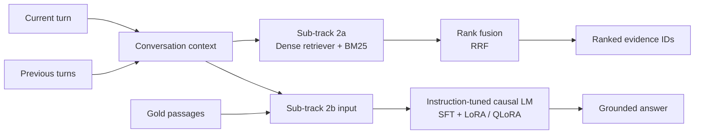

<div align="center">

# RETECO · Conversational Retrieval & Grounded Generation

**A research implementation for SemEval-2027 Task 1 — RETECO**

[](https://semeval.github.io/SemEval2027/)
[](https://datascienceuibk.github.io/RETECO/)
[](https://datascienceuibk.github.io/RETECO/task.html)
[](https://www.python.org/)
[](https://pytorch.org/)

*Retrieval that understands the current turn, the conversation so far, and the evidence needed to answer.*

</div>

---

## Overview

This repository contains an independent implementation for the **conversational part of RETECO (Track 2 / RECOR)**, a SemEval-2027 shared task on reasoning-oriented retrieval. Unlike a simple keyword search, conversational retrieval must interpret follow-up questions, resolve references such as *“that”* or *“what about the second one?”*, and find passages that actually support the current information need.

The project focuses on two complementary settings:

| Sub-track | Research question | System output | Main evaluation |
|---|---|---|---|
| **[2a — Conversational Retrieval](subtrack_2a/README.md)** | Can we retrieve relevant evidence using both the current question and dialogue history? | Ranked passage/document IDs | nDCG@10 |
| **[2b — Gold-Passage Generation](subtrack_2b/README.md)** | Given the gold evidence, can a model produce a useful, coherent, faithful answer? | A grounded answer per target turn | Five generation-judge dimensions |

Sub-track 2b deliberately receives organizer-provided gold passages. It therefore isolates **generation quality** from retrieval quality; it is not a retrieval or end-to-end RAG experiment. See the [official task definition](https://datascienceuibk.github.io/RETECO/task.html) for the full distinction.

> **Project scope:** this is a participant/research implementation, not an official RETECO organizer repository. Local experiment results are labelled separately from organizer baselines and must not be interpreted as official leaderboard results.

## System at a glance



## Repository structure

```text
.
├── README.md
├── subtrack_2a/
│   ├── README.md
│   ├── config/config.yaml
│   ├── dataset/dataset.py
│   ├── models/model.py
│   ├── utils/utils.py
│   ├── analyse_data.py
│   ├── generate_submission.py
│   ├── inference.py
│   ├── train.py
│   └── upload_to_hf.py
├── subtrack_2b/
│   ├── README.md
│   ├── config/config.yaml
│   ├── dataset/dataset.py
│   ├── models/model.py
│   ├── utils/utils.py
│   ├── analyse_data.py
│   ├── inference.py
│   └── train.py
├── data/                  # downloaded locally; do not commit the full corpus
├── checkpoints/           # generated model checkpoints; do not commit
└── outputs/               # predictions, metrics and logs
```

The directory tree above documents the intended layout. Generated datasets, checkpoints, model caches and run outputs should remain outside version control unless there is a specific reason to publish them.

## Task and data

RETECO contains two broad tracks: **temporal retrieval** (TEMPO) and **reasoning-intensive conversational retrieval** (RECOR). This repository focuses on RECOR, which contains 11 conversational domains. The public RETECO release provides train/dev records and gold judgments; the hidden SemEval evaluation set is separate.

- [Official RETECO website](https://datascienceuibk.github.io/RETECO/)
- [Task definition and sub-tracks](https://datascienceuibk.github.io/RETECO/task.html)
- [Evaluation protocol](https://datascienceuibk.github.io/RETECO/evaluation.html)
- [Dataset on Hugging Face](https://huggingface.co/datasets/DataScience-UIBK/RETECO-SemEval2027)
- [Official task/starter-kit repository](https://github.com/DataScienceUIBK/RETECO)
- [Official BM25 baseline results](https://github.com/DataScienceUIBK/RETECO/blob/main/starter_kit/BASELINE_RESULTS.md)
- [SemEval-2027 task list](https://github.com/SemEval/SemEval2027/blob/main/tasks.md)

### Downloading the data

Follow the official data instructions and place the release where the project configuration expects it. For the current configuration, the Track 2 domain files are expected beneath `data/reteco_data/track2_recor/`.

```bash
pip install huggingface_hub
hf download DataScience-UIBK/RETECO-SemEval2027 \
  --repo-type dataset \
  --local-dir data/reteco_data
```

Do not commit the full corpus to this repository. Refer to the official dataset page for current versions, licences and format details.

## Methodology overview

### Sub-track 2a — retrieve evidence

The 2a pipeline combines a dense bi-encoder based on `BAAI/bge-base-en-v1.5` with a lexical BM25 candidate ranking. The dense encoder is fine-tuned contrastively using positive evidence and hard negatives; BM25 candidates can supply hard negatives during training. At inference, ranked lists can be combined through **Reciprocal Rank Fusion (RRF)**. The configuration and evaluation details are documented in the [2a README](subtrack_2a/README.md).

### Sub-track 2b — generate from gold evidence

The 2b pipeline resolves `gold_doc_ids` to document text, prepares a prompt from the current turn, conversation history and gold passages, and fine-tunes an instruction-tuned causal language model using **Supervised Fine-Tuning (SFT)** with **LoRA/PEFT**. Optional CUDA 4-bit NF4 quantization enables QLoRA. Training labels are masked on prompt tokens so that the loss is computed on the answer target. More details and current experimental status are available in the [2b README](subtrack_2b/README.md).

## Quick start

Use the configuration and commands documented for each sub-track. A short smoke test should be run before launching a long training job.

```bash
# Sub-track 2a
python subtrack_2a/train.py --config subtrack_2a/config/config.yaml

# Sub-track 2b: lightweight end-to-end sanity check
python subtrack_2b/train.py \
  --config subtrack_2b/config/config.yaml \
  --smoke-test
```

Install dependencies into the cloud or local Python environment that you intend to use. For a GPU environment, retain the environment's compatible CUDA-enabled PyTorch build and follow the 2b README before enabling bitsandbytes quantization.

## Evaluation and reproducibility

- **2a:** use nDCG@10 for retrieval. Report the evaluated split, domain coverage, scorer, and whether the result is from dense retrieval, BM25, or fusion.
- **2b:** the official plan reports five independent generation dimensions: correctness, completeness, relevance, conversational coherence, and faithfulness. ROUGE-L, METEOR and BERTScore are additional diagnostics, not substitutes for those judgments.
- Keep train/internal-validation separation at conversation level wherever splitting is performed locally.
- Do not use reference answers to construct inference prompts or select generation candidates.
- Record model IDs, config, seed, token limits, quantization, hardware, checkpoint and run logs alongside every reported result.
- **Do not compare a local partial-domain result with the official macro-average unless the split, domain coverage and scoring procedure match.**

## Current status

| Component | Status |
|---|---|
| 2a dense + BM25 + rank fusion pipeline | Implemented and evaluated in local experiments; the README reports only the result snapshot currently available. |
| 2b data loading, gold-evidence resolution, prompt construction and SFT pipeline | Implemented and smoke-tested. |
| 2b Qwen 7B QLoRA on a 16-GiB-class T4 | Initial long-sequence run hit CUDA OOM; lower-memory sequence and LoRA settings are being investigated. No official generation score is claimed. |

## References

### RECOR: the conversational retrieval benchmark

Mohammed Ali, Abdelrahman Abdallah, Amit Agarwal, Hitesh Laxmichand Patel, and Adam Jatowt. **“RECOR: Reasoning-focused Multi-turn Conversational Retrieval Benchmark.”** *Findings of the Association for Computational Linguistics: ACL 2026*, pp. 2688–2723. [Paper](https://aclanthology.org/2026.findings-acl.129/) · [DOI](https://doi.org/10.18653/v1/2026.findings-acl.129) · [Code and benchmark](https://github.com/RECOR-Benchmark/RECOR).

```bibtex
@inproceedings{ali-etal-2026-recor,
  title     = {{RECOR}: Reasoning-focused Multi-turn Conversational Retrieval Benchmark},
  author    = {Ali, Mohammed and Abdallah, Abdelrahman and Agarwal, Amit and Patel, Hitesh Laxmichand and Jatowt, Adam},
  booktitle = {Findings of the Association for Computational Linguistics: ACL 2026},
  pages     = {2688--2723},
  year      = {2026},
  publisher = {Association for Computational Linguistics},
  doi       = {10.18653/v1/2026.findings-acl.129},
  url       = {https://aclanthology.org/2026.findings-acl.129/}
}
```

For RETECO-specific task rules, data versions and evaluation details, cite and link the [official task website](https://datascienceuibk.github.io/RETECO/). Please also cite the upstream RECOR paper when using the conversational benchmark.
