<div align="center">

# Sub-track 2a · Conversational Retrieval

**Dense retrieval + BM25 + Reciprocal Rank Fusion for RECOR**

[](https://datascienceuibk.github.io/RETECO/)
[](https://datascienceuibk.github.io/RETECO/task.html)
[](https://datascienceuibk.github.io/RETECO/evaluation.html)

</div>

[← Back to project overview](../README.md)

---

## 1. Objective

Sub-track 2a evaluates **conversational retrieval**. Given a target user turn, the preceding dialogue and the corpus for the corresponding domain, the system must rank passages that support the information need expressed by the current turn.

The key challenge is that later turns are often not standalone queries. They may contain pronouns, ellipsis, implicit references or follow-up requests whose meaning depends on earlier turns. Ranking documents from the latest sentence alone can therefore lose essential context.

**Input**

- current user turn;
- conversation history;
- domain-specific document corpus.

**Output**

An ordered ranking of supporting document IDs for each target turn. The official retrieval metric is turn-level **nDCG@10**, with additional diagnostic metrics such as Recall@10, Recall@50, MRR, domain breakdowns and conversation-depth groups.

References: [official task definition](https://datascienceuibk.github.io/RETECO/task.html) · [evaluation protocol](https://datascienceuibk.github.io/RETECO/evaluation.html).

## 2. System architecture

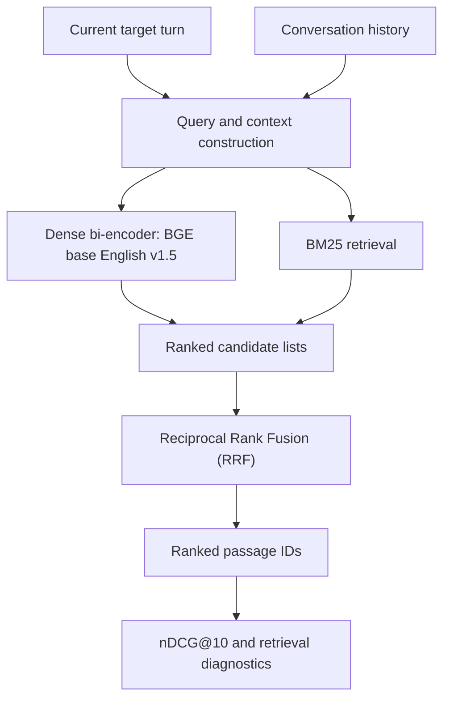

The implementation intentionally keeps the dense and lexical retrieval paths separate until fusion. This makes it possible to inspect each component independently and quantify whether fusion helps or hurts in each domain.

## 3. Methodology

### 3.1 Conversational query representation

The pipeline works at target-turn level while retaining the available conversation history. The history is important for resolving references and preserving the information already established in the dialogue. The exact prompt/query construction is controlled by the repository configuration and data utilities.

### 3.2 Dense retrieval

The dense component uses `BAAI/bge-base-en-v1.5` as its starting encoder. It learns query–passage compatibility through contrastive training with gold-positive passages and negative candidates. The current experimental configuration uses a maximum query/document length of 256 tokens.

The current training recipe uses BM25-derived hard negatives (candidate pool `top_k=20`) and up to four negatives per positive, as configured for the local experiments. These are configuration choices rather than claims that this combination is optimal across every domain.

### 3.3 Lexical retrieval

BM25 provides an independent lexical ranking. It is useful as both a retrieval baseline and a source of hard negatives for dense training. The official RETECO starter kit also publishes a reference BM25 implementation and per-domain scores; see [official baseline results](https://github.com/DataScienceUIBK/RETECO/blob/main/starter_kit/BASELINE_RESULTS.md).

### 3.4 Rank fusion

The pipeline can combine dense and BM25 rankings with **Reciprocal Rank Fusion (RRF)**. RRF combines rank positions rather than requiring the raw scores from the two retrieval methods to share the same scale. The fused list is then exported as the ranked evidence output.

The local results below show why the components are retained independently: fusion improves some domains, while a standalone dense or BM25 ranking can remain stronger in others.

## 4. Implementation map

```text
subtrack_2a/
├── config/config.yaml          # Model, data and experiment settings
├── dataset/dataset.py          # Training examples and gold/negative handling
├── models/model.py             # Dense bi-encoder
├── utils/utils.py              # Shared utilities and retrieval helpers
├── analyse_data.py             # Dataset diagnostics
├── train.py                    # Contrastive training and validation
├── inference.py                # Retrieval inference
├── generate_submission.py      # Submission/run output
└── upload_to_hf.py             # Optional artifact publishing
```

The exact modules and optional flags may evolve; use the configuration shipped with the checked-out revision as the source of truth for runnable commands.

## 5. Evaluation protocol

For official retrieval evaluation, nDCG@10 is computed per target turn and macro-averaged according to the RETECO protocol. In local development, additional metrics such as Recall@10, Recall@50 and MRR help characterize whether relevant passages are present in the candidate list even when their exact ranking differs.

For a defensible report, record:

- the split (`train` or `dev`);
- all domains included in the aggregate;
- the scorer and qrels revision;
- dense-only, BM25-only and fused results separately;
- per-domain and turn-depth results;
- the configuration, seed and checkpoint used.

## 6. Results

### 6.1 Organizer-published BM25 reference

The official RETECO starter kit reports the following **macro-average nDCG@10** for Track 2 / RECOR. The current-turn-only row is the lexical baseline without dialogue history; the history row includes the current turn and conversation history.

| Official BM25 baseline | Train nDCG@10 | Dev nDCG@10 |
|---|---:|---:|
| Current turn only | 0.1837 | 0.1827 |
| Current turn + conversation history | 0.4539 | 0.4379 |

These are organizer reference results, not measurements produced by this repository. The large difference between the two rows illustrates how important conversational context is for this benchmark. Source: [RETECO official baseline results](https://github.com/DataScienceUIBK/RETECO/blob/main/starter_kit/BASELINE_RESULTS.md).

### 6.2 Local experimental snapshot

The following values were recorded in local experimental results for eight domains. They are presented as a **partial, non-official snapshot**, not as a final full-domain macro score. The exact split/evaluation metadata and results for the remaining three domains should be consolidated from the run artifacts before making a direct numerical comparison with the official dev baseline.

| Domain | Dense nDCG@10 | BM25 nDCG@10 | RRF nDCG@10 |
|---|---:|---:|---:|
| Biology | 0.4945 | 0.5620 | **0.5761** |
| Drones | 0.3180 | 0.3237 | **0.3700** |
| Earth Science | 0.3093 | **0.6226** | 0.4946 |
| Economics | 0.3581 | **0.4651** | 0.4447 |
| Hardware | 0.2868 | 0.2751 | **0.3394** |
| Law | 0.2778 | **0.3655** | 0.3298 |
| Medical Sciences | **0.3597** | 0.1258 | 0.2379 |
| Politics | **0.4839** | 0.3289 | 0.4266 |

**Interpretation.** RRF is helpful in several domains (for example Biology, Drones and Hardware), but it is not universally superior to the strongest individual retriever. Earth Science, Economics and Law favour BM25 in this snapshot, while Medical Sciences and Politics favour the dense result. This variation motivates per-domain diagnostics rather than relying only on one aggregate.

> **Reporting note:** do not describe the table above as the official SemEval result or compare it directly with the published dev macro-average until the local split, domain coverage and scorer are verified. The snapshot currently contains eight of the eleven RECOR domains.

## 7. Diagnostic figures

The repository includes the following exploratory plots under the root-level `img/` directory. They document dataset composition and local retrieval diagnostics; they are not additional official leaderboard results. The retrieval figures should be interpreted together with the split/domain caveats in [Section 6](#6-results).

### Dataset and evidence profile

<table>
  <tr>
    <td align="center" width="50%">
      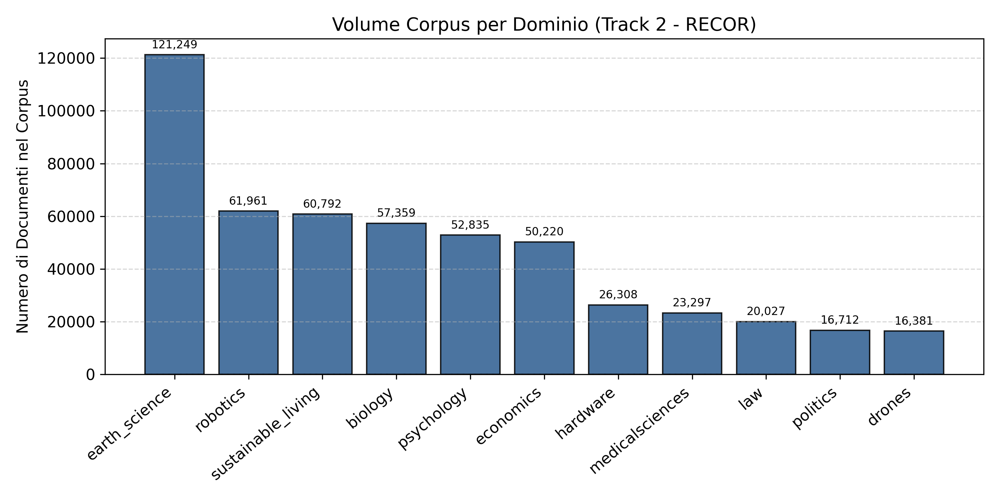
      <br><sub>Corpus size by domain</sub>
    </td>
    <td align="center" width="50%">
      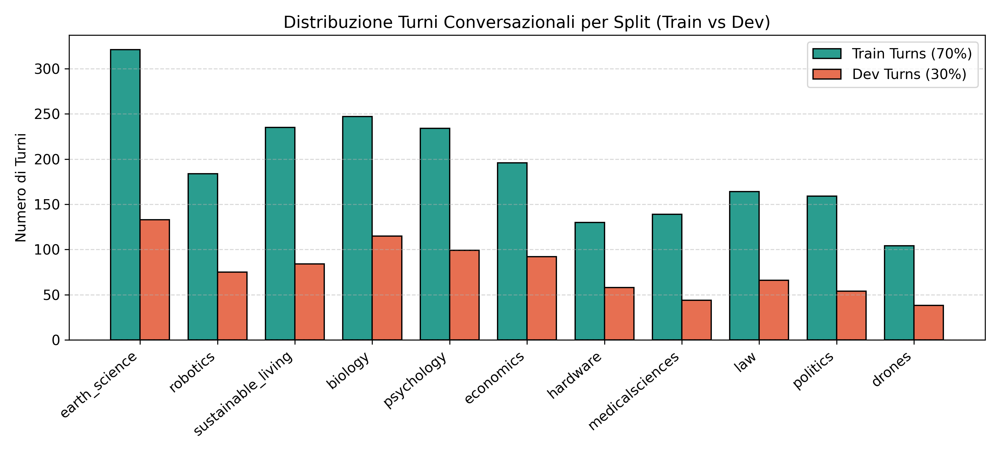
      <br><sub>Train/dev turn distribution</sub>
    </td>
  </tr>
  <tr>
    <td align="center" width="50%">
      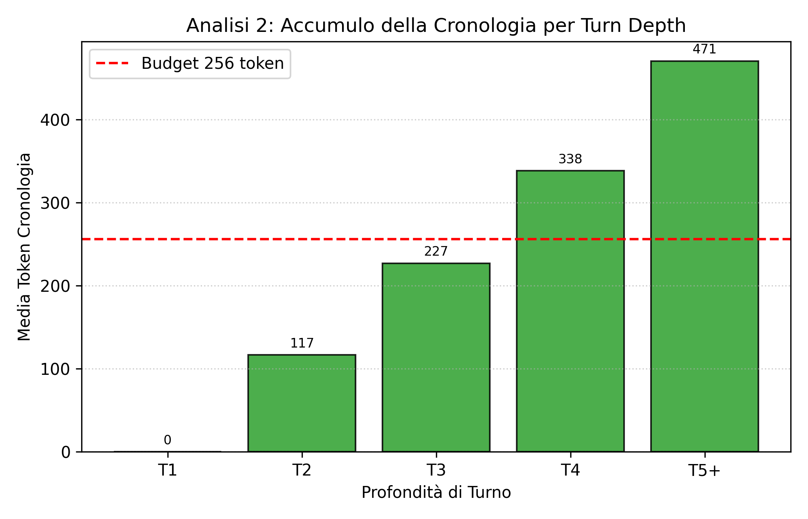
      <br><sub>History characteristics by turn depth</sub>
    </td>
    <td align="center" width="50%">
      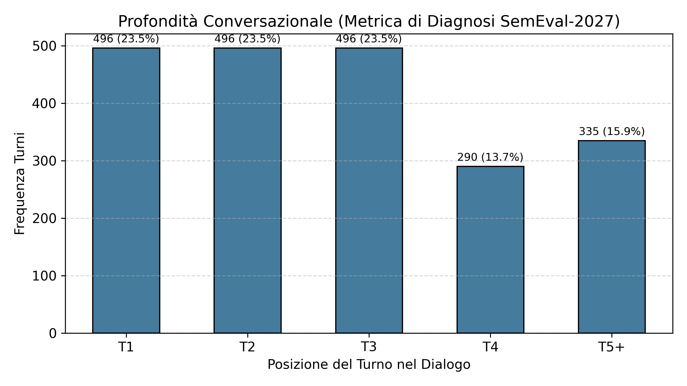
      <br><sub>Turn-depth distribution</sub>
    </td>
  </tr>
  <tr>
    <td align="center" width="50%">
      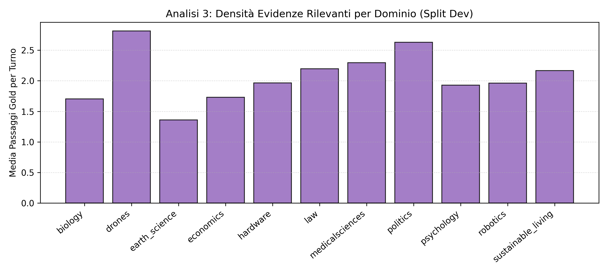
      <br><sub>Gold evidence volume by domain</sub>
    </td>
    <td align="center" width="50%">
      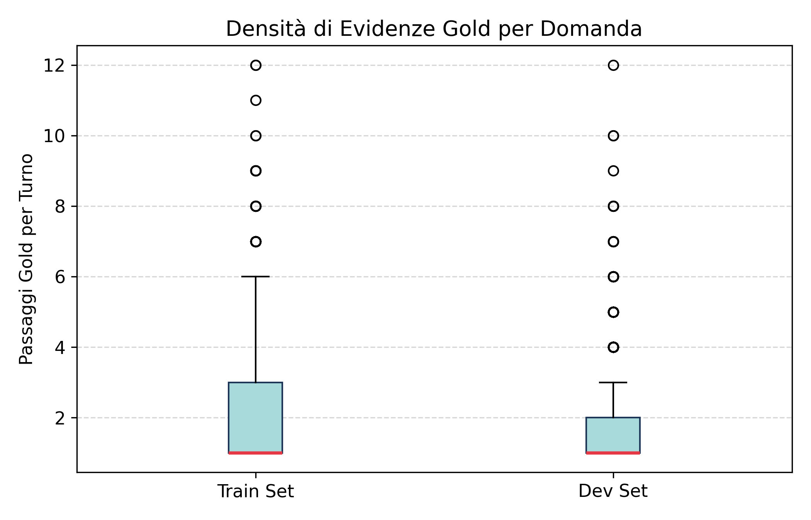
      <br><sub>Number of gold passages per turn</sub>
    </td>
  </tr>
  <tr>
    <td align="center" width="50%">
      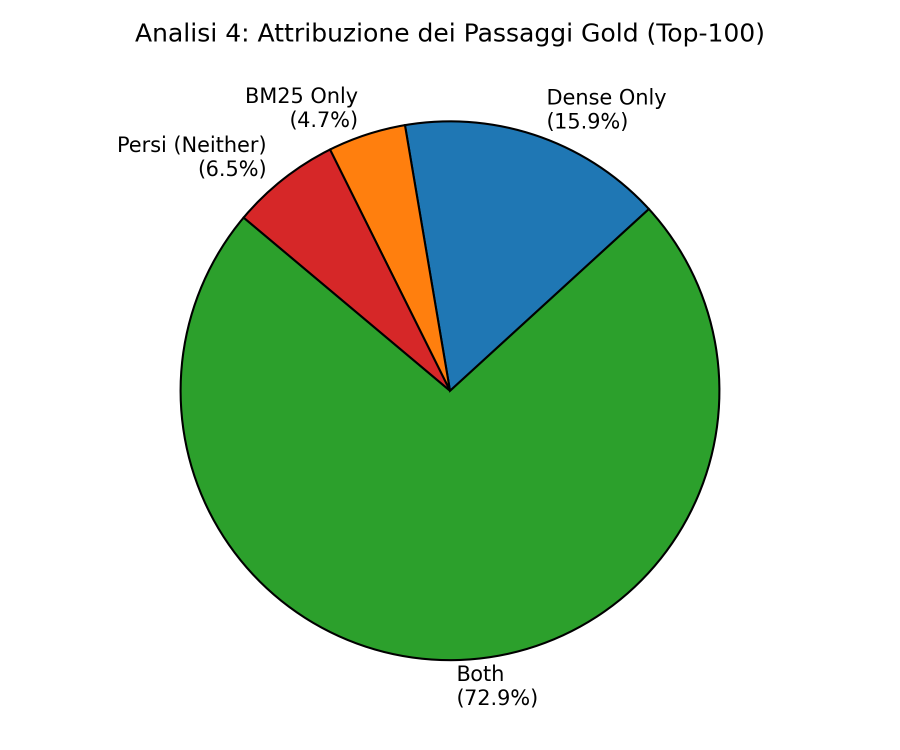
      <br><sub>Gold attribution breakdown</sub>
    </td>
    <td align="center" width="50%">
      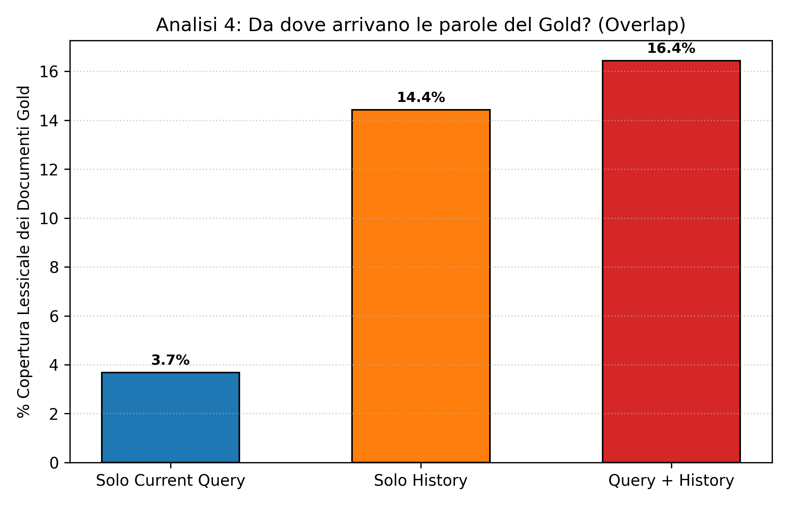
      <br><sub>Lexical overlap with gold passages</sub>
    </td>
  </tr>
  <tr>
    <td align="center" width="50%">
      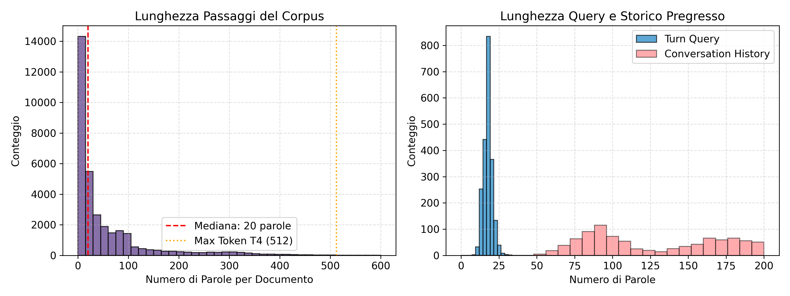
      <br><sub>Query/context length distribution</sub>
    </td>
    <td align="center" width="50%">
      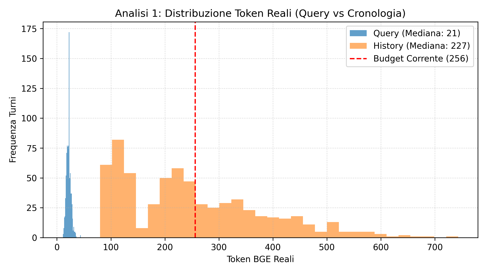
      <br><sub>Token-length profile for BGE</sub>
    </td>
  </tr>
</table>

### Retrieval diagnostics

<table>
  <tr>
    <td align="center" width="50%">
      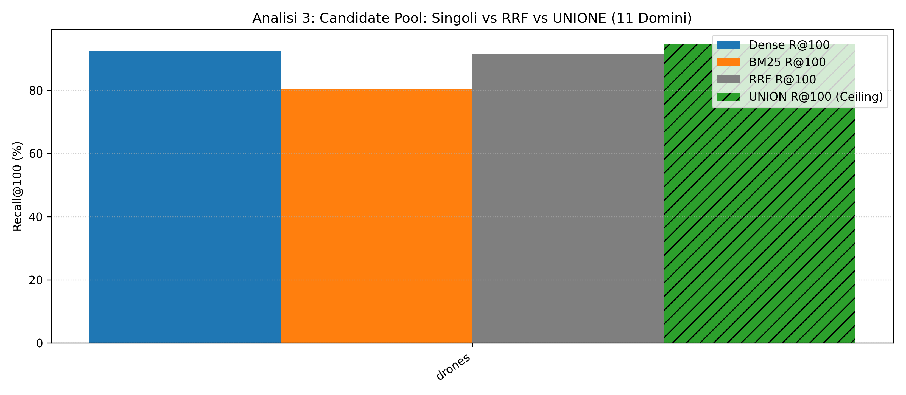
      <br><sub>Candidate union versus RRF recall</sub>
    </td>
    <td align="center" width="50%">
      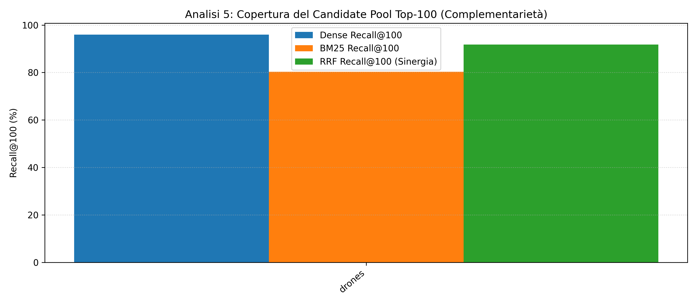
      <br><sub>Complementarity of dense and lexical candidates</sub>
    </td>
  </tr>
  <tr>
    <td align="center" width="50%">
      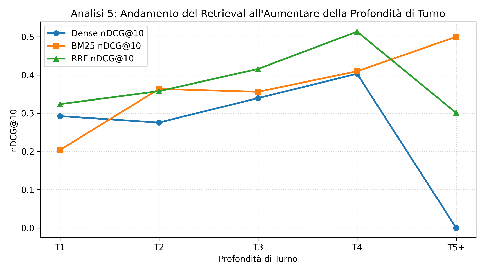
      <br><sub>Retrieval behavior by conversational depth</sub>
    </td>
    <td></td>
  </tr>
</table>

## 8. Reproducing experiments

From the repository root, configure the domain(s), data path, model and output directory in `subtrack_2a/config/config.yaml`, then run:

```bash
python subtrack_2a/analyse_data.py \
  --data_dir data/reteco_data/track2_recor \
  --output_dir outputs/subtrack_2a

python subtrack_2a/train.py \
  --config subtrack_2a/config/config.yaml
```

Inference/submission flags can change between revisions; inspect `--help` before a run:

```bash
python subtrack_2a/inference.py --help
python subtrack_2a/generate_submission.py --help
```

Do not launch a costly full training run until the data path, active domains, validation split, negative sampling and checkpoint directory have been checked in the logs.

## 9. Limitations and next steps

- The local results table is incomplete: three domain scores and final split metadata still need to be consolidated.
- Fusion is not uniformly better than the best individual retriever in the available snapshot.
- The current result snapshot should be rerun with a pinned configuration and the official scorer to establish an apples-to-apples comparison against the organizer BM25 baseline.
- Further ablations should isolate the contributions of conversation history, dense retrieval, hard negatives and rank fusion.

## References

- [RETECO official task definition](https://datascienceuibk.github.io/RETECO/task.html)
- [RETECO evaluation plan](https://datascienceuibk.github.io/RETECO/evaluation.html)
- [RETECO official BM25 baseline results](https://github.com/DataScienceUIBK/RETECO/blob/main/starter_kit/BASELINE_RESULTS.md)
- Ali et al. (2026), [*RECOR: Reasoning-focused Multi-turn Conversational Retrieval Benchmark*](https://aclanthology.org/2026.findings-acl.129/), Findings of ACL 2026.

[← Back to project overview](../README.md) · [Go to Sub-track 2b →](../subtrack_2b/README.md)
