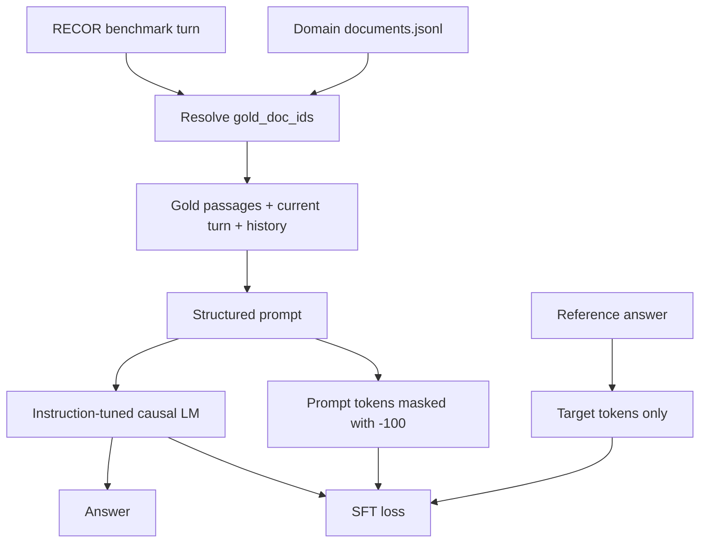

<div align="center">

# Sub-track 2b · Gold-Passage Grounded Generation

**Supervised fine-tuning for evidence-grounded conversational answers**

[](https://datascienceuibk.github.io/RETECO/)
[](https://datascienceuibk.github.io/RETECO/task.html)
[](https://huggingface.co/docs/peft/index)
[](#current-experimental-status)

</div>

[← Back to project overview](../README.md) · [← Sub-track 2a](../subtrack_2a/README.md)

---

## 1. Objective

Sub-track 2b evaluates **answer generation when the supporting passages are already provided**. The model receives the current turn, conversation history and organizer-provided gold evidence, then generates a direct response grounded in that evidence.

Unlike Sub-track 2a, 2b does **not** retrieve passages from the corpus. This isolates answer generation from retrieval quality and lets us focus on factual support, completeness and conversational fit.

| Component | Definition |
|---|---|
| Input | Current user turn + conversation history + gold passages |
| Target | Reference answer during supervised training only |
| Inference output | One answer per target `turn_id` |
| Main concern | Faithful, correct, complete and coherent response generation |

Official definition: [RETECO Sub-track 2b](https://datascienceuibk.github.io/RETECO/task.html).

## 2. Architecture



The gold reference answer is used as the supervised target during training, but it must never appear in the inference prompt or in candidate selection. The prompt and answer are tokenized as a single causal sequence; prompt labels are set to `-100`, so training loss is applied to answer tokens only.

## 3. Data preparation

### 3.1 Gold evidence resolution

RECOR records may provide `gold_doc_ids`, while the document text is stored separately in the domain corpus. The dataset layer maps each ID to its document text and preserves the listed evidence order. If direct evidence text is present in a record, the loader can use it; missing document IDs are logged instead of silently hidden.

### 3.2 Conversation-level splitting

When a local internal validation split is created, it is made at **conversation level**, not turn level. This prevents turns from a single dialogue from leaking across training and internal validation.

### 3.3 Prompt construction and ablations

The configuration supports these conceptual input ablations:

| Setting | Context provided |
|---|---|
| `A` | Current query only |
| `B` | Query + conversation history |
| `C` | Query + gold evidence |
| `D` | Query + conversation history + gold evidence (default) |
| `E` | Full context plus optional `subquestion_reasoning` metadata |

The default keeps reasoning metadata disabled and uses the history, current query and gold passages. This avoids making auxiliary annotations a hidden dependency of the generator.

### 3.4 Length management

The dataset builds a prompt using the model tokenizer/chat template when available and applies budget-aware truncation to long histories and evidence. Input and output limits are configuration values. Since some domains—especially Earth Science—contain very long evidence contexts, retention after truncation remains an important diagnostic rather than a solved problem.

## 4. Model and training recipe

The implementation uses a configurable instruction-tuned causal LM through Hugging Face Transformers, with PEFT/LoRA for parameter-efficient supervised fine-tuning.

| Setting | Current approach |
|---|---|
| Model family | Qwen2.5-Instruct |
| Fine-tuning | Supervised Fine-Tuning (SFT) |
| Adaptation | LoRA / PEFT |
| Low-memory GPU option | 4-bit NF4 QLoRA through bitsandbytes |
| Memory management | Gradient checkpointing, batch size 1, gradient accumulation |
| Hardware targets | CUDA, Apple MPS and CPU (with different performance/memory characteristics) |
| Generation strategy | Direct generation by default; optional refinement is experimental |

### Recommended low-memory configuration for a 16-GiB-class T4

The initial Qwen2.5-7B run using 4-bit QLoRA, 4,096 input tokens and 512 output tokens ran out of CUDA memory inside the causal-LM cross-entropy loss. The following is the **next configuration to test**, not a claim that a full run has already completed:

```yaml
model:
  name: "Qwen/Qwen2.5-7B-Instruct"
  load_in_4bit: true
  gradient_checkpointing: true
  lora:
    enabled: true
    r: 16
    alpha: 32
    dropout: 0.05
    target_modules:
      - "q_proj"
      - "v_proj"

data:
  max_input_tokens: 2048
  max_output_tokens: 256
  max_history_turns: 5

training:
  train_batch_size: 1
  eval_batch_size: 1
  gradient_accumulation_steps: 8
  fp16: true
  bf16: false
```

Reducing the sequence length targets the measured failure location, where the logits/loss tensors created a memory spike. Narrowing the LoRA target modules also reduces trainable parameters and optimizer state, although **sequence length is the first lever to test for this specific OOM**. If the 7B model still does not fit, use a smaller model or reduce the context budget further rather than repeatedly retrying the same configuration.

## 5. Implementation map

```text
subtrack_2b/
├── config/config.yaml       # Model, prompts, data budgets and training options
├── dataset/dataset.py       # Benchmark loading, gold lookup, truncation and label masking
├── models/model.py          # Causal LM, LoRA/QLoRA and generation wrapper
├── utils/utils.py           # Prompt helpers, logging, metrics and utility functions
├── analyse_data.py          # Domain-level context/evidence diagnostics
├── train.py                 # SFT pipeline and internal validation
└── inference.py              # Grounded generation and output serialization
```

## 6. Current experimental status

### Smoke test — completed

A local MPS smoke test using `Qwen/Qwen2.5-0.5B-Instruct` completed one short training epoch and saved both best and last checkpoints.

| Diagnostic | Observed value |
|---|---:|
| Training examples used | 8 |
| Internal validation examples used | 4 |
| Epochs | 1 |
| Training loss | 1.9218 |
| Internal validation loss | 1.3842 |
| Internal validation perplexity | 3.99 |
| Outcome | End-to-end pipeline passed |

These values verify that data loading, tokenization, forward/backward, validation and checkpoint saving work. **They are smoke-test diagnostics, not a meaningful model-quality result**: the sample is tiny and the run uses a 0.5B model.

### Qwen2.5-7B on a T4 — memory tuning required

The first full-data attempt loaded Qwen2.5-7B in 4-bit NF4 and attached LoRA successfully. It stopped after 8 of 1,933 training micro-batches in the first epoch with a CUDA OOM while computing the causal language-model loss. The observed GPU capacity was approximately 14.56 GiB, with only 1.36 GiB free at the failure.

This attempt did **not** produce a completed full-training result or a benchmark score. The reduced sequence limit and narrower LoRA configuration above are the next mitigation to test.

## 7. Evaluation

The official RETECO protocol evaluates generation using five independent judge dimensions:

1. **Correctness** — Are the factual claims accurate?
2. **Completeness** — Does the answer cover the information needed for the turn?
3. **Relevance** — Does it address the current user need directly?
4. **Conversational coherence** — Does it fit the preceding dialogue?
5. **Faithfulness** — Is it supported by the supplied passages?

The task uses separate 1–5 judgments for these dimensions. ROUGE-L, METEOR and BERTScore are additional diagnostics, not replacements for the official judgments. See the [official evaluation protocol](https://datascienceuibk.github.io/RETECO/evaluation.html).

The current repository contains local metric utilities and per-domain/turn-depth reporting. No official hidden-test score is claimed here.

## 8. Running the pipeline

### Data diagnostics

```bash
python subtrack_2b/analyse_data.py \
  --data_dir data/reteco_data/track2_recor \
  --output_dir outputs/subtrack_2b \
  --tokenizer Qwen/Qwen2.5-7B-Instruct
```

### Smoke test

```bash
python subtrack_2b/train.py \
  --config subtrack_2b/config/config.yaml \
  --smoke-test
```

### Full training

After verifying the model, data directory, token limits and GPU memory:

```bash
python subtrack_2b/train.py \
  --config subtrack_2b/config/config.yaml
```

### Inference

```bash
python subtrack_2b/inference.py \
  --config subtrack_2b/config/config.yaml \
  --split dev \
  --smoke-test
```

Check the current script's `--help` output if CLI flags have changed since this README was written.

## 9. Reproducibility and safeguards

- Keep the official dev split separate from training-driven model selection; use an internal validation split from train for early stopping.
- Never pass the reference answer into inference prompts.
- Never use reference answers for candidate selection.
- Keep official submission JSONL separate from diagnostic JSONL containing references and internal metadata.
- Record the model revision, tokenizer, seed, domain list, sequence budgets, LoRA settings, precision, quantization and hardware with every run.
- Investigate missing `gold_doc_ids` rather than silently replacing missing evidence with unrelated corpus passages.

## References

- [RETECO task definition](https://datascienceuibk.github.io/RETECO/task.html)
- [RETECO evaluation protocol](https://datascienceuibk.github.io/RETECO/evaluation.html)
- [RETECO dataset](https://huggingface.co/datasets/DataScience-UIBK/RETECO-SemEval2027)
- Ali et al. (2026), [*RECOR: Reasoning-focused Multi-turn Conversational Retrieval Benchmark*](https://aclanthology.org/2026.findings-acl.129/), Findings of ACL 2026.
- [Hugging Face PEFT documentation](https://huggingface.co/docs/peft/index)
- [Hugging Face bitsandbytes quantization documentation](https://huggingface.co/docs/transformers/en/quantization/bitsandbytes)

[← Back to project overview](../README.md) · [← Sub-track 2a](../subtrack_2a/README.md)
